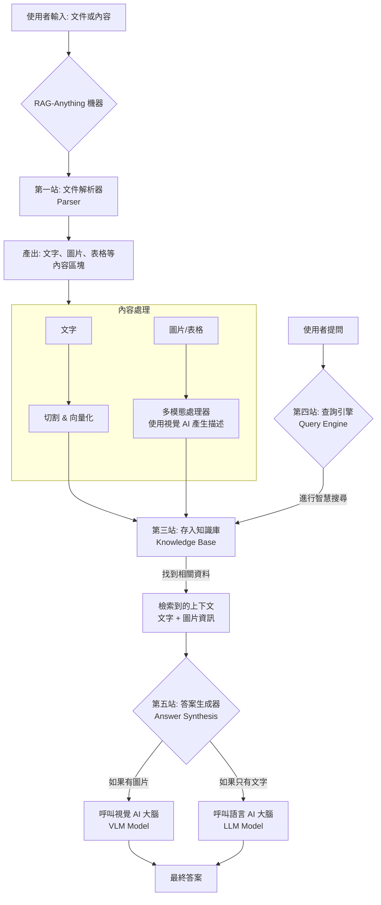

# RAG-Anything 專案說明書

這份文件會用最簡單的方式，帶你了解這個專案到底是什麼、能做什麼，以及它有多厲害！

---

### 1. 這個專案是做什麼的？它有什麼超能力？

想像一下，你拿到了一本厚厚的書、一份複雜的報告，或是一堆上課用的 PDF 講義，但你沒有時間全部讀完，只想要快速找到裡面的答案。這時候，RAG-Anything 就像你的專屬智慧書僮！

- **專案用途：** 它的主要用途是讓你能夠和「任何」文件進行「對話」。你可以把 PDF、Word 文件、PPT 簡報，甚至是包含圖片的檔案丟給它，然後像跟朋友聊天一樣，問它關於這些文件內容的問題。

- **核心功能 (超能力)：**
    1. **讀懂萬物 (Parse Anything):** 它能「拆解」並「讀懂」各種文件格式，不論是文字、圖片、表格，還是數學公式，都難不倒它。
    2. **看懂圖片 (Vision-Enhanced):** 它擁有「視覺能力」，可以看懂文件裡的圖片、圖表，並用文字告訴你那張圖在說什麼。
    3. **智慧搜尋 (Smart Search):** 它不像傳統的 Ctrl+F 只能找關鍵字。它能理解你問題的「意思」，就算你用的詞跟文件裡不一樣，它也能聰明地找到最相關的內容。
    4. **回答問題 (Answer Generation):** 找到答案後，它會使用一個非常聰明的人工智慧 (LLM) 大腦，把找到的資料整理成通順、好懂的文字來回答你。

- **實際應用場景：**
  - **作業小幫手：** 老師給了一份幾十頁的歷史資料 PDF，你可以直接問它：「根據這份文件，第二次世界大戰爆發的三個主要原因是什麼？」它就會幫你整理好答案。
  - **閱讀報告神器：** 需要交小說的讀書心得？把電子書檔案丟給它，然後問它：「主角的個性有什麼轉變？」或是「書中最重要的主題是什麼？」
  - **科學研究助理：** 看到一篇有複雜圖表的科學報告，可以直接問：「第五頁的那個圖表告訴了我們什麼趨勢？」它會幫你把圖表的意涵解釋清楚。

---

### 2. 我需要給它什麼？它會給我什麼？

簡單來說，你給它「文件」和「問題」，它給你「答案」。

- **輸入 (Input):**
    1. **你的文件：** 一個或多個檔案，例如 `report.docx`, `lecture.pdf`, `presentation.pptx` 等。
    2. **你的問題：** 一句用白話文寫的問句，例如：「這份報告的結論是什麼？」

- **輸出 (Output):**
    1. **AI 的回答：** 一段由 AI 生成的、清晰的文字答案。

- **最終產出：**
    這個專案最終的產出就是那些「AI 的回答」。不過，在背後，它還產出了一個很重要的東西，叫做**「知識庫 (Knowledge Base)」**。

    你可以把知識庫想像成是 AI 為你的文件製作的「超級索引」。它把文件的所有內容（文字、圖片描述等）都消化、整理好，存放在一個特殊的資料庫裡。正因為有了這個知識庫，當你提問時，AI 才能夠這麼快速又準確地找到相關的資訊。

---

### 3. 這個專案用了哪些 AI 大腦？

這個專案本身非常有彈性，它並沒有綁定特定的 AI 大腦。它更像一個「插座」，讓你可以自己選擇要插上哪個牌子的 AI。

在專案的範例中，它展示了如何使用 **OpenAI** 公司提供的幾種 AI 模型：

- **`gpt-4o` / `gpt-4o-mini` (主要大腦):** 這是最強大的問答大腦，負責理解你的問題和文件內容，然後寫出最終的答案。`gpt-4o` 同時也是一個「視覺模型 (VLM)」，所以它也負責「看懂」圖片。
- **`text-embedding-3-large` (語意理解模型):** 這是一個專門的 AI，負責將文字轉換成電腦能理解的「數字向量」(這就是所謂的 "Embedding")。透過這些數字，電腦才能判斷兩段文字的意思是否相近，這也是「智慧搜尋」功能的關鍵。

---

### 4. 如果我調整「設定」，會發生什麼事？

調整設定就像是調整遊戲裡的難易度或畫質，它會影響程式的執行方式。你可以在 `raganything/config.py` 這個檔案或是 `.env` 設定檔中找到它們。

- **`storage_path`:** 決定你的「知識庫」要存在電腦的哪個資料夾。
- **`parser_engine`:** 選擇用哪個工具來「拆解」文件。`mineru` 或 `docling` 是兩個不同的選項，通常不需要更動。
- **`process_image` / `process_table`:** 這是「開/關」選項 (`True` 是開, `False` 是關)。如果你把 `process_image` 設為 `False`，那 AI 就會忽略文件裡的所有圖片。這樣處理速度會變快，但如果圖片很重要，答案可能就不完整了。
- **`context_window` / `max_context_tokens`:** 控制 AI 在回答問題時，一次可以參考多少資料。數字越大，代表它可以同時看更多上下文，答案可能更詳細，但執行速度會變慢，如果你用的是付費 AI 服務，費用也會更高。

---

### 5. 怎麼執行？它的運作流程是什麼？

#### 完整執行步驟 (以範例為基礎)

1. **步驟一：設定 (Setup):** 在程式碼中，你要先設定好你的 AI 模型 API 金鑰 (例如 OpenAI API Key)，告訴程式去哪裡找到 AI 大腦。
2. **步驟二：啟動 (Initialize):** 在 Python 程式中，建立一個 `RAGAnything` 物件。這就像是發動了這台機器的引擎。
3. **步驟三：建立索引 (Index):** 使用 `.index()` 這個指令，把你的文件路徑告訴它。機器會開始閱讀、分析文件，並建立前面提到的「知識庫」。這個步驟每個文件只需要做一次。
4. **步驟四：提問 (Query):** 使用 `.query()` 這個指令，輸入你的問題。
5. **步驟五：獲得答案 (Get Answer):** 程式會去知識庫裡搜尋，把最相關的文字和圖片資訊找出來，然後交給 AI 大腦進行總結，最後把漂亮的答案回傳給你。

#### 系統架構圖 (System Architecture)

你可以把整個流程想像成一個工廠：

---

### 6. 公司可以用這個專案做什麼？

這個專案在企業內部有非常多酷炫的應用！

- **內部文件的 Google 搜尋引擎：** 大公司有成千上萬的內部文件，像是SOP、技術手冊、法規文件等。員工可以用這個專案打造一個內部搜尋系統，用問問題的方式快速找到答案。例如，問「公司對於遠端工作的最新規定是什麼？」
- **超級客服機器人：** 把所有的產品說明書、常見問答 (FAQ) 都餵給它。當客戶在網站上提問時，AI 機器人就能根據這些文件內容，準確回答客戶的問題，甚至能解釋說明書裡的圖表示意。
- **財報分析師助理：** 金融分析師需要閱讀冗長的財報，裡面充滿了表格和圖表。他們可以用這個專案，快速從財報中提取關鍵數字，或請 AI 解釋某個圖表的意義，例如：「請根據第 20 頁的圖表，說明第三季的營收成長趨勢。」

---

### 7. 我可以自己新增一個什麼樣的範例？

如果想新增一個有趣的範例，**「食譜分析師 (Recipe Book Analyst)」** 會是一個絕佳的選擇！

- **為什麼？** 食譜是一個完美的「多模態」文件。它包含了：
  - **文字：** 烹飪步驟的詳細說明。
  - **結構化資料：** 成分列表（像是表格）。
  - **圖片：** 完成品的美味照片。

- **範例玩法：**
    你可以把一本食譜的 PDF 檔丟給它，然後問各種問題：
    1. **智慧搜尋：** "幫我找一道使用巧克力但不需要烤箱的甜點食譜。"
    2. **資料提取：** "做『古典巧克力蛋糕』需要多少麵粉？"
    3. **看圖理解：** "我的蛋糕現在看起來像第 45 頁照片的樣子，請問下一步該做什麼？"

---

### 8. 這個專案還有哪些地方可以補充說明？

根據分析，這個專案已經非常強大，但在某些地方如果能有更詳細的說明文件會更好：

- **`prompt.py` 檔案的註解：** 這個檔案儲存了所有對 AI 下的「指令」(Prompt)。如果能有更多註解，解釋為什麼要用某種方式下指令才能讓 AI 做出最好的回答，對於想深入研究的使用者會非常有幫助。
- **更詳細的架構文件：** 對於想自己修改或擴充功能的開發者來說，如果有一份更深入的文件，解釋資料如何在 `RAGAnything` 和底層的 `LightRAG` 函式庫之間流動，會非常有價值。
