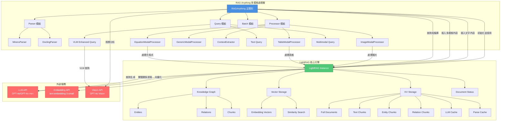
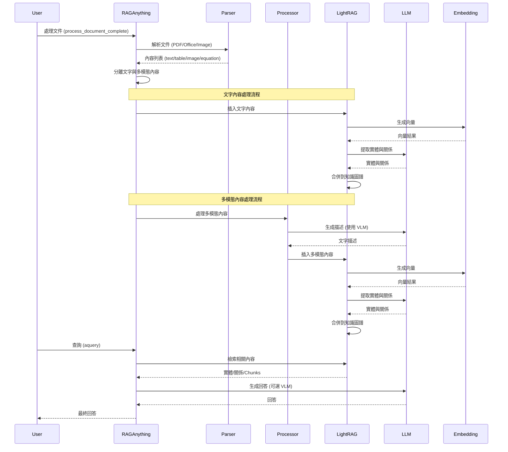
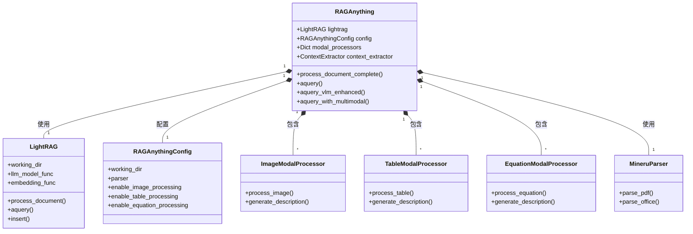
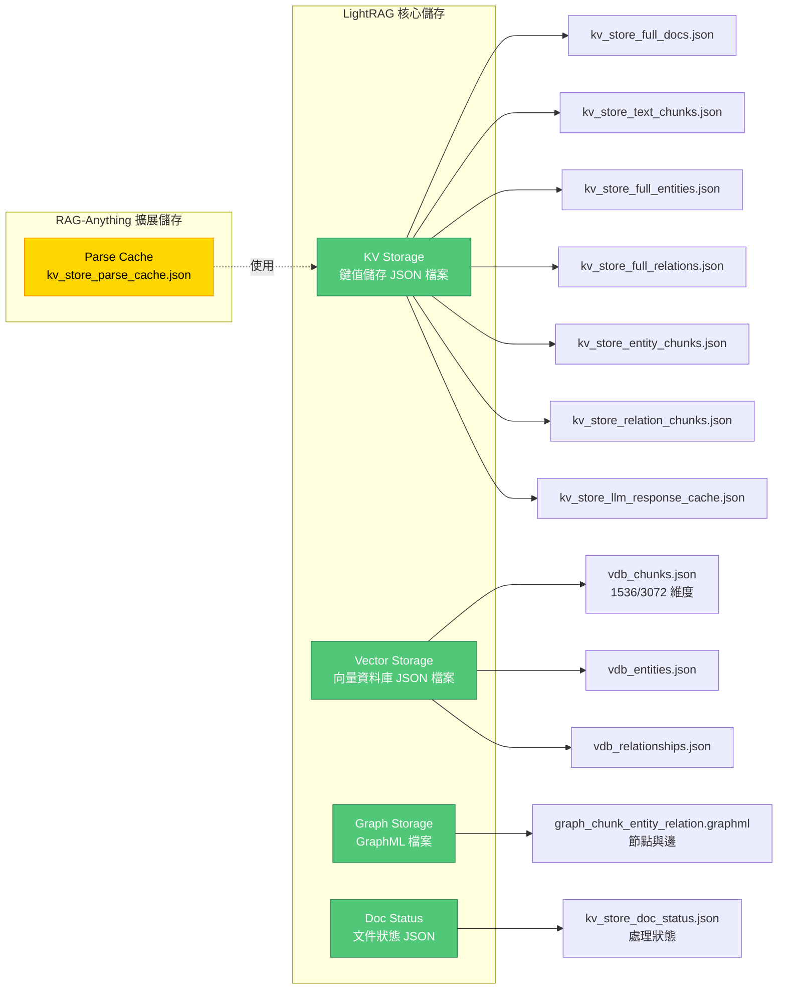

# RAG-Anything 與 LightRAG 架構關係

## 架構圖

```mermaid
graph TB
    subgraph "RAG-Anything 多模態處理層"
        A[RAGAnything 主類別] --> B[Parser 模組]
        A --> C[Processor 模組]
        A --> D[Query 模組]
        A --> E[Batch 模組]
        
        B --> B1[MineruParser]
        B --> B2[DoclingParser]
        
        C --> C1[ImageModalProcessor]
        C --> C2[TableModalProcessor]
        C --> C3[EquationModalProcessor]
        C --> C4[GenericModalProcessor]
        C --> C5[ContextExtractor]
        
        D --> D1[Text Query]
        D --> D2[VLM Enhanced Query]
        D --> D3[Multimodal Query]
    end
    
    subgraph "LightRAG 核心引擎"
        F[LightRAG Instance] --> G[Knowledge Graph]
        F --> H[Vector Storage]
        F --> I[KV Storage]
        F --> J[Document Status]
        
        G --> G1[Entities]
        G --> G2[Relations]
        G --> G3[Chunks]
        
        H --> H1[Embedding Vectors]
        H --> H2[Similarity Search]
        
        I --> I1[Full Documents]
        I --> I2[Text Chunks]
        I --> I3[Entity Chunks]
        I --> I4[Relation Chunks]
        I --> I5[LLM Cache]
        I --> I6[Parse Cache]
    end
    
    subgraph "外部服務"
        K[LLM API<br/>GPT-4o/GPT-4o-mini]
        L[Embedding API<br/>text-embedding-3-small]
        M[Vision API<br/>GPT-4o Vision]
    end
    
    A -->|"初始化並使用"| F
    A -->|"插入文字內容"| F
    A -->|"插入多模態內容"| F
    A -->|"查詢知識庫"| F
    
    C1 -->|"處理圖片"| F
    C2 -->|"處理表格"| F
    C3 -->|"處理方程式"| F
    
    F -->|"實體關係提取"| K
    F -->|"向量化"| L
    F -->|"查詢生成"| K
    
    A -->|"視覺分析"| M
    D2 -->|"VLM 查詢"| M
    
    style A fill:#4a90e2,stroke:#2c5aa0,color:#fff
    style F fill:#50c878,stroke:#2d8659,color:#fff
    style K fill:#ff6b6b,stroke:#c92a2a,color:#fff
    style L fill:#ff6b6b,stroke:#c92a2a,color:#fff
    style M fill:#ff6b6b,stroke:#c92a2a,color:#fff
```

## 資料流程圖

```mermaid
sequenceDiagram
    participant User
    participant RAGAnything
    participant Parser
    participant Processor
    participant LightRAG
    participant LLM
    participant Embedding
    
    User->>RAGAnything: 處理文件 (process_document_complete)
    
    RAGAnything->>Parser: 解析文件 (PDF/Office/Image)
    Parser-->>RAGAnything: 內容列表 (text/table/image/equation)
    
    RAGAnything->>RAGAnything: 分離文字與多模態內容
    
    Note over RAGAnything,LightRAG: 文字內容處理流程
    RAGAnything->>LightRAG: 插入文字內容
    LightRAG->>Embedding: 生成向量
    Embedding-->>LightRAG: 向量結果
    LightRAG->>LLM: 提取實體與關係
    LLM-->>LightRAG: 實體與關係
    LightRAG->>LightRAG: 合併到知識圖譜
    
    Note over RAGAnything,LightRAG: 多模態內容處理流程
    RAGAnything->>Processor: 處理多模態內容
    Processor->>LLM: 生成描述 (使用 VLM)
    LLM-->>Processor: 文字描述
    Processor->>LightRAG: 插入多模態內容
    LightRAG->>Embedding: 生成向量
    Embedding-->>LightRAG: 向量結果
    LightRAG->>LLM: 提取實體與關係
    LLM-->>LightRAG: 實體與關係
    LightRAG->>LightRAG: 合併到知識圖譜
    
    User->>RAGAnything: 查詢 (aquery)
    RAGAnything->>LightRAG: 檢索相關內容
    LightRAG-->>RAGAnything: 實體/關係/Chunks
    RAGAnything->>LLM: 生成回答 (可選 VLM)
    LLM-->>RAGAnything: 回答
    RAGAnything-->>User: 最終回答
```

## 類別關係圖

```mermaid
classDiagram
    class RAGAnything {
        +LightRAG lightrag
        +RAGAnythingConfig config
        +Dict modal_processors
        +ContextExtractor context_extractor
        +process_document_complete()
        +aquery()
        +aquery_vlm_enhanced()
        +aquery_with_multimodal()
    }
    
    class LightRAG {
        +working_dir
        +llm_model_func
        +embedding_func
        +process_document()
        +aquery()
        +insert()
    }
    
    class RAGAnythingConfig {
        +working_dir
        +parser
        +enable_image_processing
        +enable_table_processing
        +enable_equation_processing
    }
    
    class ImageModalProcessor {
        +process_image()
        +generate_description()
    }
    
    class TableModalProcessor {
        +process_table()
        +generate_description()
    }
    
    class EquationModalProcessor {
        +process_equation()
        +generate_description()
    }
    
    class MineruParser {
        +parse_pdf()
        +parse_office()
    }
    
    RAGAnything "1" *-- "1" LightRAG : 使用
    RAGAnything "1" *-- "1" RAGAnythingConfig : 配置
    RAGAnything "1" *-- "*" ImageModalProcessor : 包含
    RAGAnything "1" *-- "*" TableModalProcessor : 包含
    RAGAnything "1" *-- "*" EquationModalProcessor : 包含
    RAGAnything "1" *-- "1" MineruParser : 使用
```

## 儲存架構圖

```mermaid
graph LR
    subgraph "RAG-Anything 擴展儲存"
        A[Parse Cache<br/>kv_store_parse_cache.json]
    end
    
    subgraph "LightRAG 核心儲存"
        B[KV Storage<br/>鍵值儲存 JSON 檔案]
        C[Vector Storage<br/>向量資料庫 JSON 檔案]
        D[Graph Storage<br/>GraphML 檔案]
        E[Doc Status<br/>文件狀態 JSON]
    end
    
    B --> B1[kv_store_full_docs.json]
    B --> B2[kv_store_text_chunks.json]
    B --> B3[kv_store_full_entities.json]
    B --> B4[kv_store_full_relations.json]
    B --> B5[kv_store_entity_chunks.json]
    B --> B6[kv_store_relation_chunks.json]
    B --> B7[kv_store_llm_response_cache.json]
    
    C --> C1[vdb_chunks.json<br/>1536/3072 維度]
    C --> C2[vdb_entities.json]
    C --> C3[vdb_relationships.json]
    
    D --> D1[graph_chunk_entity_relation.graphml<br/>節點與邊]
    
    E --> E1[kv_store_doc_status.json<br/>處理狀態]
    
    A -.->|"使用"| B
    
    style A fill:#ffd700,stroke:#ff8c00,color:#000
    style B fill:#50c878,stroke:#2d8659,color:#fff
    style C fill:#50c878,stroke:#2d8659,color:#fff
    style D fill:#50c878,stroke:#2d8659,color:#fff
    style E fill:#50c878,stroke:#2d8659,color:#fff
```

**注意**：實際儲存結構為扁平化的 JSON 檔案，所有檔案都在 `rag_storage/` 目錄下，而非子目錄結構。

